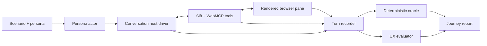

# Persona UX Evaluation Harness

Status: evaluation architecture approved, implementation pending. The existing test foundation is verified in the repository; the persona runner and scoring system described here do not yet exist.

## Purpose

The harness exists to answer the question ordinary functional tests cannot:

> Can a specific person understand and complete this decision journey, turn by turn, without knowing how Sift works?

It is part of the product-design loop, not a final QA pass. Golden personas and evaluation rules should be written before implementation, then run after every meaningful journey slice so defects change the design while it is still inexpensive to change.

## Existing foundation

The repository already provides:

- deterministic scenario trajectories and declarative assertions in `packages/scenarios`;
- real HTTP, store, runtime, pack, and WebMCP callback contract tests;
- Playwright journeys against the production build;
- pane acceptance at 390, 430, and 480 pixels plus desktop at 1440 pixels;
- named visual baselines, accessibility checks, keyboard journeys, console/network guards, and failure traces;
- command/UI/WebMCP state-equivalence tests; and
- deployed smoke checks.

Important current limits:

- `pnpm sift` currently supports pack authoring only; it is not a journey runner.
- `pnpm test:live` and `pnpm test:observability` are staged as not implemented.
- stock Playwright Chromium does not expose real WebMCP, so current E2E tests invoke the same callbacks/HTTP boundaries without claiming to be ChatGPT.
- the deployed test explicitly skips real WebMCP client registration because a ChatGPT in-app browser or compatible flagged browser is required.
- no current runner supplies a persona, conducts the conversation, observes the rendered pane each turn, and critiques the UX.

The new harness should extend these foundations rather than create an unrelated testing stack.

## Harness architecture

The persona actor, conversation host, and UX evaluator must be separate roles:

- **Persona actor:** behaves only as the defined person and uses only information visible to that person.
- **Conversation host:** plays ChatGPT's orchestration role and may invoke the exposed WebMCP tools.
- **Deterministic oracle:** checks exact state, tool, authority, evidence, and view invariants.
- **UX evaluator:** examines the conversation, screenshot, accessibility tree, visible text, and expected persona knowledge after each turn.

Using one prompt to act as the user, operate the tools, and judge itself would hide failures and inflate scores.

## Core personas

### Persona A: novice personal/family buyer

- 35 years old with low vehicle and technical knowledge.
- Two adults, two children, and a large dog.
- Describes needs in ordinary language and does not know which specifications matter.
- Has a target and hard budget but no selected candidates.
- Becomes impatient with jargon or long questionnaires.
- Needs the system to distinguish published facts from physical/test-drive unknowns.

Primary evaluation: whether Sift can guide a person who does not know how to structure the decision.

Opening:

> Use Sift to help me find the right car for my family. We have not picked any yet.

### Persona B: landscaping-business owner

- Runs a small landscaping business and needs a work vehicle.
- Thinks in equipment, payload, bed/cargo access, towing, job-site conditions, mileage, operating cost, and downtime.
- Has practical domain experience but limited patience for consumer-shopping questions.
- Has no exact candidate set and will reject irrelevant family-oriented language.
- Will proceed with explicit unknowns when a physical specification cannot be verified.

Primary evaluation: whether the same application and pack produce a materially different decision brief, candidate universe, criteria, questions, views, evidence plan, and recommendation basis.

Opening:

> Use Sift to help me find a work vehicle for my landscaping business.

### Persona C: informed, time-constrained listing comparer

- Has already selected three exact dealer listings.
- Understands the important vehicle vocabulary.
- Wants to skip general discovery and compare deal terms, ownership cost, and two personal concerns.
- Pushes back if the system asks questions already answered by the listings.
- Manually changes views while ChatGPT is working.

Primary evaluation: whether coverage guides the journey without turning into a mandatory wizard, and whether human navigation and explicit skipping are respected.

Opening:

> Use Sift to compare these three listings. I already know my requirements, so skip the general interview unless something material is missing.

## Coverage is guidance, not imprisonment

Every discovery topic has one of these states:

- `confirmed` — answered explicitly;
- `inferred_pending` — material inference awaiting confirmation;
- `deferred` — the person chose to continue without it;
- `not_applicable` — explicitly irrelevant to this case;
- `unknown` — unanswered; and
- `blocked` — required information cannot currently be obtained.

In standalone mode, the person may activate **Explore with gaps** for a soft topic. Sift then:

1. records the topic as deferred rather than complete;
2. explains the concrete limitation in one sentence;
3. proceeds when doing so is safe;
4. labels resulting candidates or comparisons preliminary; and
5. revisits the topic only if it becomes decision-critical.

In the ChatGPT/WebMCP scenario, a request to “show me options now” does not bypass pack-required coverage: ChatGPT explains the remaining material question and helps complete or mark it not applicable before search, including the contextual blind-spot review. In the standalone scenario, **Explore with gaps** may defer soft topics and must produce provisional output. Later evidence and physical-verification unknowns remain valid in both modes. Human approval, evidence integrity, and unsupported-claim boundaries remain non-skippable.

## Turn record

Each turn artifact should contain:

- scenario, persona, run, turn, model, prompt, and application version identifiers;
- user message or direct UI action;
- ChatGPT response;
- tools discovered and invoked, with bounded/redacted arguments and results;
- canonical state before and after;
- discovery coverage before and after;
- current view, view directive, presentation owner, and reason;
- screenshot at the canonical pane viewport;
- accessibility tree or equivalent visible-semantic snapshot;
- active, focused, and available controls;
- runtime/evidence events produced;
- deterministic assertion results;
- per-dimension UX evaluation with cited visible evidence; and
- timing, token, and tool-call cost.

Reports must make every low score inspectable. “Clarity: 2” without the exact confusing text, screenshot, and persona expectation is not actionable.

## What should be scored

Numerical scoring is useful for regression tracking, but only after hard correctness gates.

### Hard pass/fail gates

A journey fails regardless of its average UX score if:

- the person cannot reach the stated outcome or a truthful blocked state;
- canonical state contradicts the conversation or visible pane;
- the system invents price, availability, evidence, or confidence;
- an agent/model exercises human-only authority;
- conversational model search begins before required discovery coverage and blind-spot review complete;
- a standalone deferred answer is represented as confirmed or its output is not visibly provisional;
- a proposed/inferred need eliminates candidates without explicit blocker confirmation;
- the recommendation list issues a purchase instruction, hides an active candidate, or contradicts deterministic scoring/coverage;
- the page presents no understandable next action;
- the top orientation shell or bottom action dock disappears, covers content/focus, or offers an action inconsistent with state;
- a required view/state is absent or the pane dead-ends;
- serious accessibility violations, keyboard traps, overflow, console failures, or request failures occur; or
- consumer progress is fabricated rather than derived from real events.

### Per-turn and journey rubric

Score each dimension from 1 to 5, always with evidence:

| Dimension | Evaluation question |
| --- | --- |
| Orientation | Does the person understand where they are and what Sift is doing? |
| Next-action clarity | Is the next useful action obvious without product knowledge? |
| Relevance | Is the question or artifact appropriate to this persona and current state? |
| Efficiency | Did the system avoid redundant questions and unnecessary interaction? |
| Conversation-canvas coherence | Do chat, state, and pane visibly describe the same reality? |
| Control and flexibility | Can the person correct, skip, navigate, and retain authority? |
| Trust and evidence | Are facts, unknowns, provenance, confidence, and limitations understandable? |
| Cognitive load | Is the visible information bounded and comprehensible at the pane size? |

Initial acceptance should require:

- every hard gate passes;
- median journey score of at least 4 for every dimension;
- no turn scores below 3 for Orientation or Next-action clarity;
- no unexplained score variance greater than one point across repeated evaluator runs; and
- no regression from the approved baseline without explicit review.

These thresholds should be calibrated after baseline runs. They are starting review criteria, not scientifically validated usability norms.

### Objective journey metrics

Track alongside model judgments:

- turns to first useful candidate set;
- total discovery questions and redundant questions;
- missing required topics, standalone-deferred topics, and unnecessary revisits;
- blind-spot suggestions shown, accepted, dismissed, duplicated, and judged irrelevant;
- user corrections caused by bad interpretation;
- view changes, immediately reversed view changes, and human navigation overrides;
- turns where no clear next action is visible;
- time to first useful candidate set, Quick Pick completion, shortlist, and decision/blocked outcome;
- background jobs started, reused, cancelled/staled, duplicated, and focused after human dispositions;
- recommendation-order changes and whether each has a traceable canonical cause;
- candidate diversity and constraint violations;
- unsupported claims and facts later contradicted;
- tool calls, failures, retries, latency, and model cost; and
- final unresolved critical versus accepted unknowns.

Do not collapse the report into one magic number. A high average cannot cancel one authority violation, fabricated fact, or dead-end. A hackathon-readiness summary may display the dimension medians only after every hard gate passes.

## Evaluator reliability

Model-judged UX is probabilistic. Reduce noise by:

- freezing persona, rubric, evaluator prompt, model/version, viewport, and seed where supported;
- running each persona at least three times and reporting median plus range;
- keeping the evaluator separate from the acting persona and conversation host;
- requiring the evaluator to cite visible text, state, and screenshot regions;
- using deterministic assertions whenever a fact can be checked mechanically;
- sending high-variance or threshold-adjacent findings to human review; and
- preserving every artifact so score changes can be explained.

The model evaluator should suggest findings, not automatically rewrite the product. Each accepted defect becomes a requirement and a regression assertion at the lowest reliable test layer.

## Execution layers

### Layer 1: deterministic CI

Run scenario, reducer, command, contract, component, accessibility, and Playwright assertions on every relevant change. This remains the release gate and does not require an external model.

### Layer 2: model persona runner

A future `pnpm test:persona` CLI starts the real application, drives a Playwright browser plus the same model-context adapter, conducts the conversation, and writes complete turn artifacts. It can run locally or in a controlled CI/nightly environment with explicit model credentials.

This is a realistic host simulation, not proof of ChatGPT-host compatibility.

### Layer 3: real WebMCP host acceptance

At product milestones and before submission, run the same personas in an actual WebMCP-capable ChatGPT or compatible host. Codex can assist with an interactive browser audit, but repository CI cannot presently launch and control the ChatGPT in-app browser. Record timestamp, host, discovered tools, transcript, screenshots/video, case/run IDs, and outcome.

### Layer 4: small human usability pass

Even for a hackathon, one or more people who did not build the product should attempt the opening task without coaching. Model personas are excellent regression tools but cannot fully replace real confusion, hesitation, trust, and visual preference.

## Development loop

1. Define or revise the golden persona and expected outcome.
2. Write hard state/view/authority assertions and the UX rubric expectation.
3. Implement one vertical journey slice.
4. Run deterministic tests and the persona journey.
5. Review the turn report, screenshots, and evaluator evidence.
6. Classify findings as product defect, evaluator noise, scenario flaw, or intentional tradeoff.
7. Fix accepted defects and add deterministic regression coverage where possible.
8. Repeat until thresholds pass without hiding unknowns or scripting around the persona.
9. Re-run in the real WebMCP host before freezing the demo.

## Hackathon use

The WebMCP demo should complete one primary journey, then use a short second-case contrast to prove adaptation:

1. run the novice personal/family case far enough to show discovery, direct preference interaction, candidates, and investigation;
2. open a landscaping-business case with the same Sift application and vehicle pack;
3. show that the brief, questions, criteria, candidates, and planned research are materially different; and
4. expose the developer/judge projection proving both experiences came from pack/case state and tool/runtime decisions rather than two hardcoded demo pages.

Two complete demos would consume the video. One complete journey plus a fast, visible contrast better proves generality inside a short submission.

## Decisions for review

1. Use three core personas: novice personal/family, landscaping business, and informed known-listing comparer.
2. Treat coverage as mode-aware state: complete required conversational coverage before search, allow standalone Explore with gaps for soft topics, and preserve later evidence/physical unknowns.
3. Add per-dimension numerical UX scores, objective metrics, and non-negotiable hard gates rather than one overall score.
4. Design the harness before implementation and build it alongside the journey.
5. Reuse the existing scenario and Playwright stack, adding a model persona/host/evaluator layer.
6. Require real-host acceptance before submission while keeping deterministic CI honest about what it can and cannot prove.
